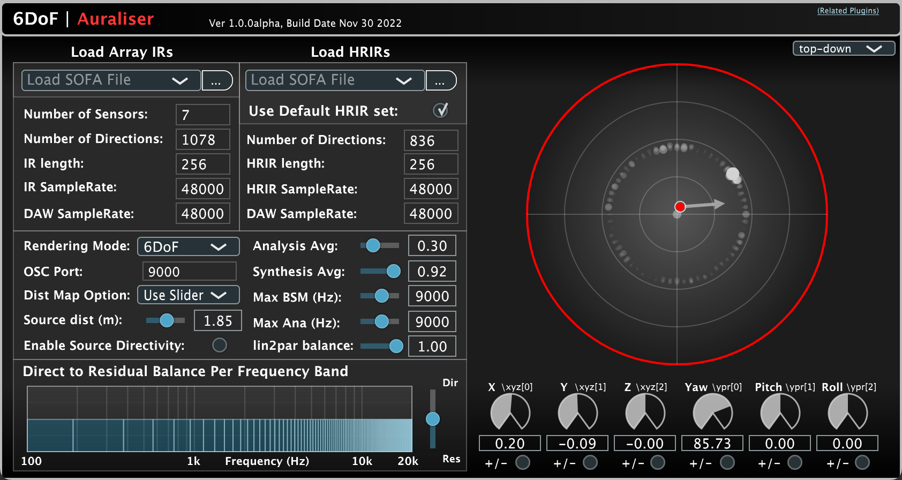

# 6DoF-Auraliser

An auralisation system that takes a head-worn microphone array recordings as input and renders the audio for binaural playback; taking into account both the listener's head-orientation and relative position from the recording point.

The system is realised as a real-time VST audio plugin, which supports:
* Loading ATFs and HRTFs via the SOFA standard
* The ability to change the balance between the directional and ambient rendering streams per frequency band.

Developed using [JUCE](https://github.com/WeAreROLI/JUCE/) and the [Spatial_Audio_Framework](https://github.com/leomccormack/Spatial_Audio_Framework).



## Documentation

Doxygen based documentation may be generated with the following command:
```
cd docs/doxygen
doxygen doxygen_config
```
This can then be viewed in your browser by opening: docs/doxygen/html/index.html


## How to compile?

The instructions for building the plugin are the same as those for building the [SPARTA plugins](https://github.com/leomccormack/SPARTA)

The TL;DR: the plug-ins may be built with CMake (version 3.15 or higher).

**MacOS**: To build a universal (ARM and x86_64 compatible) version of the audio plugin and unit testing program:
```
mkdir build
cmake -S . -B build -DSAF_PERFORMANCE_LIB=SAF_USE_APPLE_ACCELERATE -DCMAKE_OSX_ARCHITECTURES="arm64;x86_64" 
cd build
make
```

**Windows** (x86_64):
```
cmake -S . -B build -G "Visual Studio 15 2017" -DCMAKE_GENERATOR_PLATFORM=x64 -DSAF_PERFORMANCE_LIB=SAF_USE_INTEL_MKL_LP64
cd build
msbuild ALL_BUILD.vcxproj /p:Configuration=Release /m
```
Note: Windows versions require intalling Intel's OneAPI (specifically for Intel MKL), and running the build scripts found in extern/Spatial_Audio_Framework/scripts. 

**Linux**: (x86_64) using Intel MKL:
```
mkdir build
cmake -S . -B build -DSAF_PERFORMANCE_LIB=SAF_USE_INTEL_MKL_LP64
cd build
make
```
Note: this require intalling Intel's OneAPI (specifically for Intel MKL), and running the build scripts found in extern/Spatial_Audio_Framework/scripts. 

**Linux**: (x86_64) using OpenBLAS:
```
mkdir build
cmake -S . -B build -DSAF_PERFORMANCE_LIB=SAF_USE_OPEN_BLAS_AND_LAPACKE
cd build
make
```
Note: this require intalling OpenBLAS and LAPACKE with e.g.:
```
sudo apt-get install liblapack3 liblapack-dev libopenblas-base libopenblas-dev liblapacke-dev
```

## Developers

* **Leo McCormack** (contact up until December 2nd 2022: leo.mccormack@meta.com, or afterwards: leo.t.mccormack@gmail.com)

## Reference

(Submitted for review)

## License

The majority of 6DoF-Auraliser is licensed under GNU General Public License v.3 license, however portions of the project are available under separate license terms: COMPASS-ref and portions of Spatial_Audio_Framework are licensed under the GNU General Public License v2.0 license; Spherical-Harmonic-Transform, Spherical-Array-Processing, Higher-Order-Ambisonics, Vector-Base-Amplitude-Panning, Array-Response-Simulator, HO-SIRR, shoebox-roomsim are licensed under the BSD 3-Clause "New" or "Revised" License; afSTFT is licensed under the MIT license; portions of Spatial_Audio_Framework are licensed under the ISC license.
